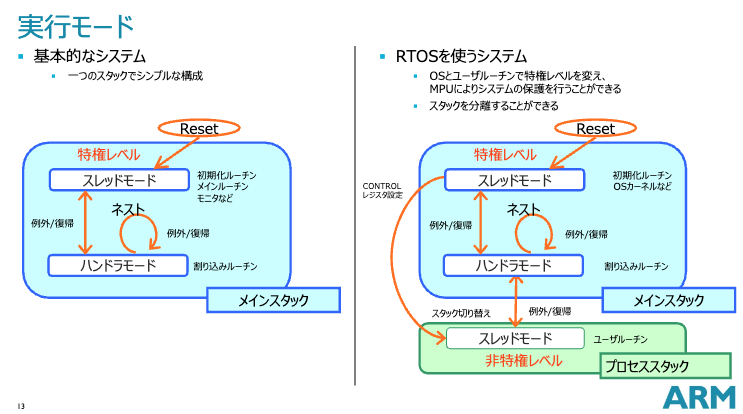
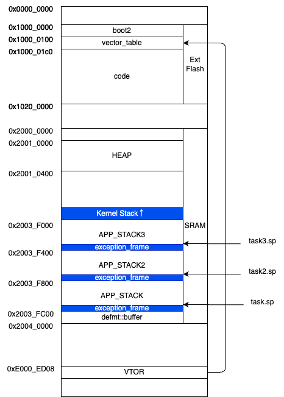

Raspberry Pi Pico(RP2040)上で動作するRTOS(Real Time OS:リアルタイムOS)を自作する。技術コンセプトの実証のためのプロトタイプだが、タスク切換え、SysTickのハンドリング、タスクの停止、システムコール、などの機能を持っている。類似の多くの情報があるが、Cortex-M3のマイコンをターゲットにしたものが多い。RP2040はCortex-M0+コアであり、更にマルチコアであり、それらの既存の情報がうまく適用できない場面が多い。本記事は、とくに差異において注意する点をとりあげた。また、組み込みRustの分野は進歩が早く、できるだけ新しいプラットフォーム(Embedded-Rustチームが提供する`cortex-m`, `cortex-m-rt`, HALなど)を活用するようにした。

主に『[Rustで始める自作組み込みOS入門](https://nextpublishing.jp/book/14912.html)』の内容をなぞっているが、必要な箇所についてはCortex-M0+対応している。並列処理のコア部分については『[詳解 Rustアトミック操作とロック](https://www.oreilly.co.jp/books/9784814400515/)』が非常に参考になる。RP2040固有部分については『[インターフェイス 2024年11月 ゼロから作るマルチコアOS](https://interface.cqpub.co.jp/magazine/202411/)』を参考にした。

RTOSを実装ということでは、タスク切換えがコアな技術となる。

それだけではなく、次のような技術が必然的に必要となり、それらはRTOS以外にも応用がきく技術だ。とくに、MutexとCellについては、この課題によって格段に自然に使いこなせるようにになった。

* プラットフォームであるARMの関数呼び出し規約、アセンブラ(ARM特有の命令、Cortex-M0とM3の違い)、インラインアセンブラの書き方
* マルチコアのハンドリング
* メモリマップの設計とリンカスクリプトやコンパイラ注釈を利用した割り当て方法
* ハードウエアリソースの初期化と複数タスクへの共有の方法。ハードウエア・レジスタは本質的に`&'static mut`となるが、Rustはデータ保護のために、そういうものを容認していない。`Mutex`によるロック、`Cell`による内部可変、`Option`による定数初期化などの技術が必要
* `Mutex`の実装、その裏にあるアトミック操作の実装と本質
* グローバル・アロケータの実装

今回の実装については、[]()に履歴付きでアップしてある。この記事では省略した詳細についてはソースコードを直接参照してほしい。

## 目次

<!--ts-->
- [目次](#目次)
- [主な構成と機能](#主な構成と機能)
- [前提とするハードウエア](#前提とするハードウエア)
- [`cortex-m-rt`によるエントリーポイント、初期化ルーチン、例外ハンドラ](#cortex-m-rtによるエントリーポイント初期化ルーチン例外ハンドラ)
  - [`#[entry]`](#entry)
  - [`#[pre_init]`](#pre_init)
  - [`#[exception]`](#exception)
  - [`VTOR`と割り込みベクタのアドレス](#vtorと割り込みベクタのアドレス)
- [Cortex-M0+(ARM-v6M,thumbv6m) で注意すること](#cortex-m0arm-v6mthumbv6m-で注意すること)
  - [アトミック命令](#アトミック命令)
  - [即値命令](#即値命令)
  - [スタックに積めるレジスタ](#スタックに積めるレジスタ)
  - [`ldmia`,`stmia`が元レジスタを壊す](#ldmiastmiaが元レジスタを壊す)
- [関数呼び出し手順(AAPCS: Arm Architecture Procedure Call Standard)](#関数呼び出し手順aapcs-arm-architecture-procedure-call-standard)
  - [コアレジスタ](#コアレジスタ)
- [RP2040で注意すること](#rp2040で注意すること)
  - [SIO::SpinLock](#siospinlock)
  - [boot2](#boot2)
- [タスク切換え](#タスク切換え)
  - [特権モード](#特権モード)
  - [例外フレーム](#例外フレーム)
  - [タスク切換えの実装(SVCall Handler)](#タスク切換えの実装svcall-handler)
  - [メモリマップ](#メモリマップ)
  - [タスクスタック領域の初期化](#タスクスタック領域の初期化)
  - [タスク構造体](#タスク構造体)
  - [タスク切換えの実装(fn execute\_task)](#タスク切換えの実装fn-execute_task)
- [タスクスケジューラ](#タスクスケジューラ)
  - [タスクを次々に実行する](#タスクを次々に実行する)
  - [アイドルタスクでスリープする](#アイドルタスクでスリープする)
  - [タスクの休止状態とスリープ](#タスクの休止状態とスリープ)
  - [タスクの生成とスケジューラへの登録](#タスクの生成とスケジューラへの登録)
- [Mutexの実装](#mutexの実装)
  - [Rustでの`Mutex`](#rustでのmutex)
  - [`Mutex`と`RwLock`](#mutexとrwlock)
  - [実装例](#実装例)
- [グローバル・アロケータと`alloc`クレート](#グローバルアロケータとallocクレート)
- [alloc::boxed::Box, Box::leak()](#allocboxedbox-boxleak)
- [SysTickハンドラ](#systickハンドラ)
- [デバイスドライバ](#デバイスドライバ)
  - [リソースの共有方法](#リソースの共有方法)
- [gdbの使い方](#gdbの使い方)
- [参考文献](#参考文献)

<!-- Created by https://github.com/ekalinin/github-markdown-toc -->
<!-- Added by: nkon, at: 2024年 12月18日 水曜日 21時35分54秒 CST -->

<!--te-->

## 主な構成と機能

* Raspberry Pi Pico上のRP2040上で動作するRTOS
    + Cortex-M0+(ARM-v6M:thumbv6m)のデュアルコア
        - 割り込み禁止によるクリティカルセクションではなく、RP2040のコアのSpinLockペリフェラルを使って排他制御を行う
* SysTickを使った強制タスクスイッチ(非協調マルチタスク)で複数のタスクをを切り替えて並列実行する
    + タスクの優先度は未実装
    + リソースを消費し続けるアプリケーションタスクからも他のタスクに実行権が移る
    + アイドルタスクが実行されている間はWFIでスリープする
    + タスクのスリープを実装し、他のタスクを実行しているあいだ、そのタスクを休止することができる
* Embedded Rust プロジェクトで提供されるフレームワーク(`cortex_m`,`cortex_m_rt`,Peripheral Access Crate(PAC)など)を利用する
* Mutex, グローバルアロケータを実装し、`alloc`クレートが使える
* ボード上のLEDを駆動するためのデバイスドライバを実装し、複数のアプリケーションタスクからデバイスを駆動できる  

## 前提とするハードウエア

RP2040を搭載したRaspberry Pi Picoをハードウエアとする。安価だが、一般的に用いられているCortex-M3のシングルコアMCUとは違う点が多い。

プロジェクトの立ち上げ方法については[別記事(Raspberry Pi PicoとRustで組み込みプログラム環境を整える)を参照](https://nkon.github.io/RasPico-Rust/)。

## `cortex-m-rt`によるエントリーポイント、初期化ルーチン、例外ハンドラ

`cortex-m-rt`は`#[entry]`、`#[pre_init]`、`#[exeption]`という関数修飾マクロを提供している。

### `#[entry]`

必須。初期化ルーチン(慣習的に`crt0`と呼ばれる)がメモリを初期化をしたあと、内部的に、`fn main`が呼ばれ、`fn main`は`#[entry]`が付けられた関数を呼ぶ(内部的には`__cortex_m_rt_main`という関数になる)。

### `#[pre_init]`

`#[pre_init]`が付けられた関数があれば、`crt0`が、`fn main`を呼ぶ前にその関数を呼ぶ。

`#[pre_init]`関数と`#[excption]`関数(後述)は、`unsafe`モードで実行されるので、追加の`unsafe`指定は不要。

### `#[exception]`

次の名前の関数に、`#[exception]`をつければ、それは例外ハンドラとなり、該当する例外が発生したときに呼ばれる。もしユーザがこれらの例外ハンドラを作成しなければ`DefaultHandler`が呼ばれる。

* `DefaultHandler`
* `NonMaskableInt`
* `HardFault`
* `MemoryManagement` (a)
* `BusFault` (a)
* `UsageFault` (a)
* `SecureFault` (b)
* `SVCall`
* `DebugMonitor` (a)
* `PendSV`
* `SysTick`

(a) Not available on Cortex-M0 variants (thumbv6m-none-eabi)

(b) Only available on ARMv8-M


Rustの関数を書けば、割り込みベクタへの登録(boot2の初期値である0x2000_0100から)をおこなってくれるので便利。しかし、次の点でいえば、かえって不便とも言える。

* 自動で関数プロローグ、エピローグが挿入されてしまい、とくに例外ハンドラの場合は本来の動作に影響を与える。
* 登録先が規定の割り込みベクタのため、あとからハンドラを差し替えたり、別のコアのためにSRAM上に割り込みベクタテーブルを構築したい場合に自由度がきかない。

### `VTOR`と割り込みベクタのアドレス

Cortex-Mは割り込みベクタテーブルのアドレスは固定ではなく可変。その先頭アドレスを`PPB`の中の`VTOR`というレジスタ(0xe000_ed08)に設定する。

RP2040の通常の起動シーケンスにおいては、内蔵ROMの起動⇒boot2の実行。このときに、boot2が`VTOR`を0x2000_0100(外付けFlashのboot2の次のエリア)にセットする。

`cortex-m-rt`の標準のリンカスクリプト(link.x)が`.vector_table`というセクションを定めていて、そのセクションが0x2000_0100に割り付けられる。コード中では`#[link_section=".vector_table.exception]"`として、割り込みベクタテーブルを指定のセクションに配置できる。また、上述のように`#[exception]`などをつければ、その関数を指定のベクタに登録できる。

起動後に割り込みハンドラを再割り当てしたい場合には、`cortex-m-rt`の機能の外になるが、`unsafe extern "C" fn()`の配列として、割り込みベクタテーブルをSRAM中に確保して、`VTOR`をセットすればよい。

## Cortex-M0+(ARM-v6M,thumbv6m) で注意すること

組み込みRustに関する記事や書籍も多い。しかし、それらのほとんどがCortex-M3またはそれ以上のプロセッサを前提としている。Cortex-M3はARM-v7Mアーキテクチャ(thumbv7em)である。しかし、今回ターゲットとしているRP2040はCortex-M0+で、アーキテクチャはARM-v6Mである。いくつかの命令や機能が実装されておらず、注意しなければならないことがおおい。

Raspberry Pi Pico2に搭載されているRP2350はCortex-M33デュアルコアであり、ほとんどの情報が適用できる。さらにRISC-Vコアも搭載されているので、そちらも試すことができる。素晴らしい。

### アトミック命令

Rustでは言語レベルでデータ競合が防止されている。そこを「かいくぐる」手段として`Mutex`などのロック手段が用いられる。

多くの場合、その実装には`AtomicU32`などのアトミック変数が用いられる。そして、それらはコンパイルされるときに、MCUのアトミック演算を用いる。

しかし、Cortex-M0(ARM-v6M: thumbv6m)には、Cortex-M4(ARM-v7M: thumbv7em)にある`ldrex`, `strex`命令が存在しない。「ベアメタル用」でも多くのライブラリが、`Atomic`変数を用いたロックに依存しているので(例えば`lazy-static`など)、そういったクレートはCortex-M0+では使うことができない。

`cortex-m`では、そこも考慮して、割り込み禁止を用いたロックが提供されている。しかしRP2040ではそれも使えない(後述)。

### 即値命令

Cortex-M0+では多くの命令が16ビット固定長で32ビット拡張命令が少ない。それらの制限を受けるものの一つに、即値のビット長が小さい、ということがある。

たとえば16bitの`cmp`命令は即値部分が8bitなので、最大255までの即値とレジスタを比較することができる。一方、Cortex-M3は32bitの`cmp.w`命令があり、より大きな範囲の即値と比較することができる。

よって、Cortex-M0+で大きな即値比較する場合は、いったん、他のレジスタにロードしてから比較する。その場合でも、ロードされる即値はPC相対でロードする命令にアセンブラによって書き換えられる。

Cortex-M3の場合
```rust
    asm!(
        "cmp lr, =0xfffffff9",
    );
```
Cortex-M0の場合
```rust
    asm!(
        "ldr r3, =0xfffffff9",
        "cmp lr, r3",
    );
```
Cortex-M0のアセンブラ
```
10000c14: 4b0a         	ldr	r3, [pc, #0x28]         @ 0x10000c40 <PendSV+0x3c>
10000c16: 459e         	cmp	lr, r3
...
10000c40: f9 ff ff ff  	.word	0xfffffff9
```

### スタックに積めるレジスタ

もうひとつのCortex-M0+の命令の制限として、`push`,`pop`命令で扱えるレジスタセットが限られている、という点がある。

x86とはことなり、armの場合は、複数のレジスタをまとめてpush/popできる。pushするレジスタはビットマップ形式で表現されており、ビットが立っているレジスタがプッシュされる。

16bitの`push`命令ではレジスタリストに割り当てられたビットは8bitなので、`r0-r7`と`lr`しかpushできない。`r8-r12`をプッシュしたいときは、いったん`r0-r7'にコピーしてからプッシュする必要があり、非常に使い勝手が悪くなる。

しかし、Cortex-M3は32ビットの`push.w`命令がサポートされているので、`push`命令ですべてのレジスタをpushできる。

### `ldmia`,`stmia`が元レジスタを壊す

複数のレジスタをロード、ストアする`ldmia`,`stmia`命令だが、Cortex-M0には、退避先を示すレジスタが命令実行後に壊れる`ldmia!`,`stmia!`命令しかサポートされていない。もし壊されてはならないときは自力でスタックに対比して置かなければならない。

## 関数呼び出し手順(AAPCS: Arm Architecture Procedure Call Standard)

ARMプロセッサ上での関数呼び出し規約は必修だ。以下はAAPCS32に定められる32ビットプロセッサの呼び出し規約の概要。詳細は仕様書を参照のこと。

### コアレジスタ

| 名前    | 役割                     | 例外 | push     |
| ------- | ------------------------ | ---- | -------- |
| r0      | 引数1、結果1、スクラッチ | 保存 | サポート |
| r1      | 引数2、結果2、スクラッチ | 保存 | サポート |
| r2      | 引数3、       スクラッチ | 保存 | サポート |
| r3      | 引数4、       スクラッチ | 保存 | サポート |
| r4      | 汎用                     |      | サポート |
| r5      | 汎用                     |      | サポート |
| r6      | 汎用                     |      | サポート |
| r7      | 汎用                     |      | サポート |
| r8      | 汎用                     |      |          |
| r9      | 汎用                     |      |          |
| r10     | 汎用                     |      |          |
| r11     | 汎用、フレームポインタ   |      |          |
| r12     | IP                       | 保存 |          |
| r13(sp) | スタックポインタ         |      |          |
| r14(lr) | リンクレジスタ           | 保存 | サポート |
| r15(pc) | プログラムカウンタ       | 保存 |          |

* `r0-r3`は引数を渡す。入り切らない場合はスタックに積まれる。
    + つまり、速度のためには、引数の数は4個までが望ましい。`&self`がある場合は`r0`となるので残りは3つ。
* 戻り値は通常`r0`だが、`r1`を使って8バイトまでの構造体を返せる。
* `r4-r8,r10,r11`はローカル変数のために使われる。はみ出す場合はスタック。Cortex-M0+(Thumb命令セット)の場合は`r4-r7`がすべての命令でサポートされている。
* 呼び出された関数は`r4-r8,r10,r11,sp`を壊してはならない。
* 関数からリターンするときは`blx Rm`(通常の関数)、`bx Rm`(末尾関数)を使う。
    + `blx`, `bx`の場合は状態変更なども行う
    + `pop pc`も使用可能
    + `mov pc, Rm`は非推奨


## RP2040で注意すること

### SIO::SpinLock

一般的なCortex-M0+コアと異なり、RP2040はCortex-M0+のデュアルコアである。

最も大きな違いは、割り込み禁止によるクリティカル・セクションが作れないこと。割り込み禁止はコアごとに動作する。一つのコアで割り込みを禁止しても、他方のコアは自由にクリティカルなメモリにアクセスできてしまう。

それに対する支援として、ハードウエアでSpinLockが提供されている。これは1ビットの値を持つレジスタで、SIO領域に32個存在し、双方のコアからアクセスできる。

それを使って両方のコアで有効なスピンロックを実装できる。

### boot2

もうひとつ特徴的なものは`boot2`ブートローダだ。一般的なシステムでは、リセットアドレスからFLASHの先頭にジャンプし、ユーザコードをFLASHの先頭におけば、即座に実行される。

RP2040では、内蔵ROMは、外付けフラッシュの先頭にジャンプするが、そこには`boot2`と呼ばれるブートローダを書き込む。そして、`boot2`がユーザコードを実行する。通常は`boot2`はBSP(Board Support Package)クレートがハンドリングするが、自前で置き換えることもできる([boot-k](https://nkon.github.io/RP2040-Boot2/)プロジェクトを参照)。


## タスク切換え

RTOSと自称するための最も基本的な機能であるタスク切換えについて。

最も簡単にいえば、タスク切換え＝タスクごとにレジスタとスタックとPC(命令ポインタ: IntelではIP(インストラクションポインタ)と呼ばれるが、ArmではPC(プログラムカウンタ)と呼ばれる)を切り替えること。そうすれば、タスクが切り替わったときに、そのタスクは自分の「世界(PC、レジスタ、スタック)」が見える。メモリ空間はタスクごとに分離されていない。

Cortex-M上で動作する場合、コアが提供するタスク切換えの支援機構を使う。

### 特権モード

* Mode: Handler, Thread。例外ハンドリングはハンドラモードで、それ以外はThreadモードで実行される。リセット直後はスレッドモード。
* Privilege: Privileged, Unprivileged。特権モードでは全ての命令が実行可能。非特権モードでは命令が制限される。CONTROL.nPRIVビットが1のときは非特権モード。Unprivileged拡張の実装はMPUによって任意。RP2040は実装あり。
* Stack pointer: Cortex-MはMain(MSP), Process(PSP)の2つのスタックポインタを持つ。ハンドラモードでは常にMSPが使われる。CONTROL.SPSELが1のときはPSPが使われる。選択されているスタックポインタがSP(r13)にエイリアスされる。

この3つを組み合わて、次の構成とする。

| Mode    | Privilege    | Stack Pointer | Usage        |
| ------- | ------------ | ------------- | ------------ |
| Handler | Privileged   | Main          | 例外ハンドラ |
| Thread  | Privileged   | Main          | OSの実行     |
| Thread  | Unprivileged | Process       | アプリの実行 |

ARMがだしているパワポの図がわかりやすい。



[https://os.mbed.com/media/uploads/MACRUM/cortex-m_mbed_deep-dive_20140704a.pdf](https://os.mbed.com/media/uploads/MACRUM/cortex-m_mbed_deep-dive_20140704a.pdf)


### 例外フレーム

例外発生したとき、Cortex-Mはいくつかの情報を呼び出し側のスタックに積んで、例外ハンドラに飛ぶ。それらは「例外フレーム」と呼ばれる。例外フレームは8バイトアラインとなっている。もしその時のSPが4バイト境界にいたときは、アライメントが調整されて、例外フレームが積まれる。

戻ってきたときは、例外フレームは元のレジスタに復帰される。

```rust
_code)]
pub struct ExceptionFrame {
    r0: u32,
    r1: u32,
    r2: u32,
    r3: u32,
    r12: u32,
    lr: u32,
    pc: u32,
    xpsr: u32,
}
```

`lr`(リンクレジスタ)は、通常関数呼び出し時には、戻りアドレスがセットされるが、例外ハンドラに飛んだ場合は、次の特別なアドレス(`EXC_RETURN`)になっている。

* 0xFFFF_FFF1: ハンドラモードから呼ばれた。
* 0xFFFF_FFF9: 特権モード、かつ、スレッドモードから呼ばれた。
* 0xFFFF_FFFD: 非特権モード、かつ、スレッドモードから呼ばれた。

逆に、このアドレスにリターン(`bx`または`PC`に`pop`)すると、次の動作をする。

* 0xFFFF_FFF1: ハンドラモードに戻る。レジスタ類はMSPから復帰され、その後の実行もMSPが使われる。
* 0xFFFF_FFF9: スレッドモードに戻る。レジスタ類はMSPから復帰され、その後の実行もMSPが使われる。(カーネル実行)
* 0xFFFF_FFFD: スレッドモードに戻る。レジスタ類はPSPから復帰され、その後の実行もPSPが使われる。(アプリ実行)

そして、実行を再開する。

* 戻り先の`SP`(`MSP`または`PSP`)が指している例外フレームを復帰
    + `MSP`, `PSP`の値は例外ハンドラの呼び出しで変化しない
* そこに含まれていた`PC`から実行を再開

### タスク切換えの実装(SVCall Handler)

Cortex-Mでは`svc`命令を実行することによって`SVCall`例外を発生させる。

`SVCall`ハンドラはカーネルモードとアプリケーションモードの実行を切り替えるように実装する。

つまり、アプリケーションから呼ばれたらカーネルに、カーネルから呼ばれたらアプリケーションに移行する。
* アプリケーション: スレッドモード、非特権モード、PSP
* カーネル: スレッドモード、特権モード、MSP

これらを踏まえ、SVCallの例外ハンドラは次の擬似コードのように書ける。

```
    if lr == 0xFFFF_FFF9 {     // もし特権モードから呼ばれたら
        CONTROL.nPRIV = 1;     // 非特権フラグをセットして
        bx 0xFFFF_FFFD;        // 非特権、スレッドモードで実行再開。PSPレジスタを使う。
                               // PSPで指定されていた例外フレームを復帰し、その`PC`から実行を再開
    } else {                   // もし非特権モードから呼ばれたら
        CONTROL.nPRIV = 0;     // 非特権フラグをクリアして
        bx 0xFFFF_FFF9;        // 特権、スレッドモードで実行再開。MSPレジスタを使う。
                               // PSPで指定されていた例外フレームを復帰し、その`PC`から実行を再開
    }
```

実際にRustで(というかインラインアセンブラで)書くと次のようになる。

```rust
#[exception]
fn SVCall() {
    unsafe {
        asm!(
            "pop {{r7}}", // Adjust SP from function prelude "push {r7, lr};add r7, sp, #0x0"
            "pop {{r3}}", // dummy pop for lr
            "ldr r3, =0xfffffff9", //If lr(link register) == 0xfffffff9 -> called from kernel
            "cmp lr, r3",
            "bne 1f",
            "movs r0, #0x3",
            "msr CONTROL, r0",     //CONTROL.nPRIV <= 1; set unprivileged
            "isb",                 // Instruction Synchronization Barrier
            "ldr r3, =0xfffffffd", // Return to Thread+PSP
            "mov lr, r3",
            "bx lr",
            "1:",
            "movs r0, #0",
            "msr CONTROL, r0", //CONTROL.nPRIV <= 0; set privileged
            "isb",
            "ldr r3, =0xfffffff9", // Return to Thread+MSP
            "mov lr, r3",
            "bx lr",
            options(noreturn),
        );
    };
}
```
実際のアセンブラが次。

```
10001130 <SVCall>:
10001130: b580         	push	{r7, lr}
10001132: af00         	add	r7, sp, #0x0
10001134: bc80         	pop	{r7}
10001136: bc08         	pop	{r3}
10001138: 4b09         	ldr	r3, [pc, #0x24]         @ 0x10001160 <SVCall+0x30>
1000113a: 459e         	cmp	lr, r3
1000113c: d107         	bne	0x1000114e <SVCall+0x1e> @ imm = #0xe
1000113e: 2003         	movs	r0, #0x3
10001140: f380 8814    	msr	control, r0
10001144: f3bf 8f6f    	isb	sy
10001148: 4b06         	ldr	r3, [pc, #0x18]         @ 0x10001164 <SVCall+0x34>
1000114a: 469e         	mov	lr, r3
1000114c: 4770         	bx	lr
1000114e: 2000         	movs	r0, #0x0
10001150: f380 8814    	msr	control, r0
10001154: f3bf 8f6f    	isb	sy
10001158: 4b01         	ldr	r3, [pc, #0x4]          @ 0x10001160 <SVCall+0x30>
1000115a: 469e         	mov	lr, r3
1000115c: 4770         	bx	lr
1000115e: defe         	trap
10001160: f9 ff ff ff  	.word	0xfffffff9
10001164: fd ff ff ff  	.word	0xfffffffd
```

これを踏まえて逐行解説する。

```rust
#[exception]
fn SVCall() {
```
* この関数を`SVCall`の例外ハンドラとして登録する。
    + `cortex-m-rt`によって、関数のアドレスがベクタテーブル(フラッシュの先頭付近:0x2000_01c0)に登録される。 
```rust
    unsafe {
        asm!(
```
* インラインアセンブラなので`unsafe`。
```rust
            "pop {{r7}}", // Adjust SP from function prelude "push {r7, lr};add r7, sp, #0x0"
            "pop {{r3}}", // dummy pop for lr
```
* 関数プレリュード(下)が関数の先頭に自動で挿入されるので、補正する。最初の`pop {r7}`は、`push r7`を戻す。
* 次の`pop {r3}`は、`push`された`lr`を`pop`して`SP`の位置をあわせる。
* インラインアセンブラ中では`{`,`}`は`{{`,`}}`と書く
```
10001130: b580         	push	{r7, lr}
10001132: af00         	add	r7, sp, #0x0
```
```rust
            "ldr r3, =0xfffffff9", //If lr(link register) == 0xfffffff9 -> called from kernel
            "cmp lr, r3",
```
* `lr`と`0xffff_fff9`の比較。即値で比較できないので、いったん`r3`にロードする。
* 例外ハンドラに飛んでくる前に`r0-r3`,`r12`は例外フレームに積まれるので、例外ハンドラ中では`r3`は破壊可能。
```rust
            "bne 1f",
```
 * `lr`が`0xffff_fff9`と等しくなければ(=非特権モードから呼ばれたら)、後方の`:1`ラベルにジャンプ。
```rust
            "movs r0, #0x3",
            "msr CONTROL, r0",     //CONTROL.nPRIV <= 1; set unprivileged
            "isb",                 // Instruction Synchronization Barrier
```
* `lr`が`0xffff_fff9`と等しければ(=特権モードから呼ばれたら)、つづいてここが実行される。
* `CONTROL`レジスタに`0x03`(=nPRIVフラグ)をセットしたいが、いったん`r0`にロードする。
* `CONTROL`レジスタにロードするときは特別命令である`msr`を使う。
* `CONTROL`レジスタを変更したあとは、メモリバリア命令`isb`で変更が有効になるまで待つ。
```rust
            "ldr r3, =0xfffffffd", // Return to Thread+PSP
            "mov lr, r3",
            "bx lr",
```
* リターンアドレスを`0xffff_fffd`(=非特権、スレッド、PSP)にセット(`EXC_RETURN`)。Cortex-M0+では`lr`に直接この長さの即値をロードできないので、いったん`r3`にロード。
    + アセンブラでは`r3`への即値ロードとして書かれているが、実際にはPC相対ロードにアセンブルされる。
* `lr`にリターンアドレスをセット。
* `lr`にジャンプ。
```rust
            "1:",
            "movs r0, #0",
            "msr CONTROL, r0", //CONTROL.nPRIV <= 0; set privileged
            "isb",
            "ldr r3, =0xfffffff9", // Return to Thread+MSP
            "mov lr, r3",
            "bx lr",
```
* `lr`が`0xffff_fff9`と等しくなければ(=非特権モードから呼ばれたら)、ここに飛んでくる。
* あとは上と同様。
* `0xffff_fff9`(=特権、スレッド、MSP)に`EXC_RETURN`する。
```rust
            options(noreturn),
        );
    };
}
```
* この関数からはリターンしない。
```
1000115e: defe         	trap
10001160: f9 ff ff ff  	.word	0xfffffff9
10001164: fd ff ff ff  	.word	0xfffffffd
```
* 関数末尾にオーバーラン防止用の`trap`とPC相対で参照される即値が配置される。

### メモリマップ




### タスクスタック領域の初期化

非常に大雑把にいえば、タスクの作成＝タスクスタック領域の作成＋スタックの初期化＋タスク構造体の作成＋タスク関数ポインタの登録。

`SVCall`ハンドラで実行モードの切り替えができるので、ここでは実行される環境(タスク情報を保存するタスク構造体、タスクごとのスタック領域)を用意し、それらが適切に切り替わるように実装する。

* タスクスタック領域は、今回の実装では静的領域に確保する
    + タスクスタック領域は`.uninit`セグメントの中にリンカで割り当てる
    + `.uninit`セグメントの上に、カーネルスタックが割り当てられる
* タスクSPはタスクスタック領域の中を指す
    + スタック操作によってタスクSPはタスクスタック領域の中を移動する
        - pushされるとアドレスが減る、popされるとアドレスが増える
* タスクスタック領域の「底」に初期例外フレームを作成し、適切に初期化する
    + タスクSPの初期値は初期例外フレームの「上」を指す。  
    + タスク実行中に例外が発生したときは、その時の`SP`の上に例外フレームが積まれる
* タスク構造体はヒープ中に作成する。ベアメタルでヒープを使うために、`GlobalAllocator`を定義し、`alloc`クレートを使用する。
    + `GlobalAllocator`は`HEAP`領域からメモリを割り当てる
        - 今回の実装では、要求されたメモリを割り当ててポインタを進めるが、開放しない「Bump Pointer Allocator」を実装する 
    + タスク構造体はリンクリストでつなげて管理し(リンクリストのノードもヒープ中に確保される)、カーネルのスケジューラによって順次実行される。 


```rust
pub const STACK_SIZE: usize = 1024;

#[repr(align(8))]
pub struct AlignedStack(pub MaybeUninit<[u8; STACK_SIZE]>);
```
* ひとつのアプリごとに1024バイトのスタック領域を割り当てる
* スタック領域の初期化
    + 8バイトアライン
    + u8 x STACK_SIZEの配列
    + 初期化されていない(`MaybeUninit`)
    + 一つしか要素がないが、構造体名を`AlignedStack`
```rust
    #[link_section = ".uninit.STACKS"]
    static mut APP_STACK: AlignedStack = AlignedStack(MaybeUninit::uninit());
    let task = Box::new(Task::new(
        unsafe { &mut *addr_of_mut!(APP_STACK) },
        app_main,
    ));
    let item: &'static mut ListItem<Task> = Box::leak(Box::new(ListItem::new(*task)));
    SCHEDULER.write().push_back(item);
```
* `.uninit`セクションに割り当てる
* `static mut`として変数を確保する。コレに対する操作は`unsafe`となる
* タスク構造体(`Task`)をヒープ上に割り当てる
* リストノードを作成する
    + この関数のスコープを抜けてもメモリ領域が有効であるように`Box::leak()`で`&'static`な値数に束縛させる
* スケジューラに登録する(後述)
    + スケジューラがなくても、カーネル⇔単一のアプリケーションタスク、のタスク切換えは可能 


### タスク構造体

タスクを切り替えるときに保存しなければならない情報を保持するために、タスク構造体を作り、タスクごとの`SP`、レジスタを保存する。

* 例外フレームに保存されないレジスタ(`r4-r11`)を保存/復帰する。
* タスクごとの`SP`を保存/復帰する。


```rust
pub struct Task<'a> {
    sp: usize,
    regs: [u32; 8], // r4, r5, r6, r7, r8, r9, r10, r11
    state: TaskState,
    wait_until: Option<u32>,
    marker: PhantomData<&'a u8>,
}
```
* `sp`に、このタスクの`SP`を保存
    + 前述のように、タスクごとのスタック領域を作成し、タスク構造体の`sp`がその中を指すようにしておく 
* `regs`に`r4-r11`を保存する。しかし、Cortex-M0+(ARM-v6M)の`push`命令の制限のため、今回は`r4-r7`しか保存しない
    + 本来であれば`r8-r11`も`r4-r7`経由で保存するべき
* `state`, `wait_until`は後で使用
* `marker`は、ライフタイムを管理するためのサイズが無いメンバー

```rust
impl<'a> Task<'a> {
    pub fn new(stack: &'a mut AlignedStack, app_fn: fn() -> !) -> Self {
        let sp = (stack.0.as_ptr() as usize) + STACK_SIZE - size_of::<ExceptionFrame>();
        let exception_frame: &mut ExceptionFrame = unsafe { &mut *(sp as *mut ExceptionFrame) };
        unsafe {
            exception_frame.set_r0(0);
            exception_frame.set_r1(0);
            exception_frame.set_r2(0);
            exception_frame.set_r3(0);
            exception_frame.set_r12(0);
            exception_frame.set_lr(0);
            exception_frame.set_pc(app_fn as usize as u32);
            exception_frame.set_xpsr(0x0100_0000); // Set EPSR.T bit
        }

        Task {
            sp,
            regs: [0; 8],
            state: TaskState::Ready,
            wait_until: None,
            marker: PhantomData,
        }
    }
}
```
* タスク構造体(これはヒープ上に割り当てられる)の初期化時に、タスクスタック領域に初期例外フレームを作成する。
    + タスクの初期`SP`は初期例外フレームの先頭を指す

### タスク切換えの実装(fn execute_task)

タスクを切り替えるときは、`svc`命令を実行すれば、上述の`SVCall`ハンドラが実行され、タスクが切り替わる。

カーネルから次の関数を呼べば、事前準備を行い、タスクの実行に切り替わり、その実行が終わって戻ってきたときの処理を行う。
```rust
#[inline(never)]
fn execute_task(mut sp: u32, regs: u32) -> u32 {
    unsafe {
        asm!(
            "push {{r4, r5, r6}}",       // r7, lr are pushed by prorogue
            "push {{ {regs} }}",         // save r1
            "ldmia {regs}!, {{r4-r7}}",  // load r4-r7 from backup
            "msr psp, {sp}",
            "svc 0",
            "pop {{ {regs} }}",
            "stmia {regs}!, {{r4-r7}}",  // save r4-r7 to backup
            "mrs {sp}, psp",
            "pop {{r4, r5, r6}}",        // r7, pc are popped by prorogue
            sp = inout(reg) sp, regs = in(reg) regs,
        );
    };
    sp
}
```

タスクごとのメンバ関数として、次のラッパーを作る。
```rust
    pub fn exec(&mut self) {
        info!("execute task {:x}", self.sp);
        self.sp = execute_task(self.sp as u32, &mut self.regs as *mut u32 as u32) as usize;
    }
```

アセンブラを参照しながら、逐行解説。

```
10001104 <rrtos::task::execute_task::h43d78dfdd0bc44d5>:
10001104: b580         	push	{r7, lr}
10001106: af00         	add	r7, sp, #0x0
10001108: b470         	push	{r4, r5, r6}
1000110a: b402         	push	{r1}
1000110c: c9f0         	ldm	r1!, {r4, r5, r6, r7}
1000110e: f380 8809    	msr	psp, r0
10001112: df00         	svc	#0x0
10001114: bc02         	pop	{r1}
10001116: c1f0         	stm	r1!, {r4, r5, r6, r7}
10001118: f3ef 8009    	mrs	r0, psp
1000111c: bc70         	pop	{r4, r5, r6}
1000111e: bd80         	pop	{r7, pc}
```

```rust
#[inline(never)]
fn execute_task(mut sp: u32, regs: u32) -> u32 {
```
* 関数呼び出し規約(後述)どおりに、第一引数(`sp`)が`r0`、第二引数(`regs`)が`r1`に割りあたって欲しいので`#[inline(never)]`とする
* 第一引数は、タスクごとの`SP`、第二引数はレジスタ退避用のバッファ
```rust
    unsafe {
        asm!(
            "push {{r4, r5, r6}}",       // r7, lr are pushed by prorogue
```
* 例外フレームに保存されない`r4-r6`を現在のスタック(=この関数を呼ぶのはカーネルなので、カーネルのスタック)に保存する
* `r7`, `lr`は関数プレリュードでスタックに`push`されている
```rust
            "push {{ {regs} }}",         // save r1
```
* Cortex-M0+(ARM-v6M)の場合、その後の`ldmia!`命令で`r1`が壊されるので、スタックに保存する
    + `asm!`末尾のパラメータ指定により、`{regs}`は`r1`に展開される 
```rust
            "ldmia {regs}!, {{r4-r7}}",  // load r4-r7 from backup
```
* タスクの保存バッファからタスクのレジスタ(`r4-r7')をロードする
    + `r0-r3`,`r12`は例外フレームから復帰される
    + `r8-r11`は、現在の実装では無視する
```rust
            "msr psp, {sp}",
```
* タスクの`SP`を`PSP`にロードする。
    + `{sp}`は`r0`に展開される
```rust
            "svc 0",
```
* `svc`命令を実行し、SVCall例外を発生させる
* `SVCall`ハンドラが呼ばれ、`EXC_RETURN`=`0xffff_fffd`にリターンする
    + 非特権、スレッド、PSPで、引数`sp`で示されたスタック、例外フレームから復帰したレジスタ、レジスタバッファ`regs`でで復帰したレジスタ(PCも含む)、の状態で、指定したタスクが実行される
* タスク側で`svc`命令が呼ばれたら、再度`SVCall`ハンドラが呼ばれ、`EXC_RETURN`=`0xffff_fff9`によって、ここに実行が戻って来る。
```rust
            "pop {{ {regs} }}",
```
* タスクのレジスタ退避バッファのアドレスが入っていた`r1`をスタックから復元する
```rust
            "stmia {regs}!, {{r4-r7}}",  // save r4-r7 to backup
```
* タスク側で使っていた`r4-r7`をレジスタ退避バッファに保存する
```rust
            "mrs {sp}, psp",
```
* タスクの`PSP`をタスク構造体に保存するために`r0`にセット
    + 関数呼び出し規約により`r0`はこの関数(`execute_task`)の戻り値となる
```rust
            "pop {{r4, r5, r6}}",        // r7, pc are popped by prorogue
```
* `r4-r6`をカーネルスタックから復帰する
    + 現在の実装では`r8-r11`は無視 
* この後に、下の関数プロローグが挿入される
    + `r7`をスタックから復帰する
    + `pc`をスタックから復帰=呼び出し時の`lr`(=呼び出し元のアドレス)から実行継続=関数リターン

```
1000111e: bd80         	pop	{r7, pc}
```

```rust
            sp = inout(reg) sp, regs = in(reg) regs,
```
* 第一引数(`sp`)は入出力、第二引数(`regs`)は入力専用であることをコンパイラに伝える
```rust
        );
    };
    sp
}
```
* タスクの`PSP`を`fn execute_task()`の戻り値として返す
    + このタスク実行の間にSPが変化しているので、次の実行再開に備えて`PSP`をタスク構造体に上書き保存する。

## タスクスケジューラ

### タスクを次々に実行する

タスク構造体を作成し、リストにつなげ、それぞれのタスクごとに上記の`Task::exec()`を呼び出せば、次々にタスクが実行される。それぞれのタスクは無限ループとして実行される。

タスクの無限ループのなかで、`svc`命令を呼び出せば、カーネル側(カーネル側ではタスクスケジュールが実行されている)に制御が戻り、タスクスケジューラによって次のタスクの実行が再開される。

`asm!("svc 0")`をラップするような`back_to_kernel()`というライブラリ関数を提供し、アプリ側はそれを呼ぶことによって、協調的マルチタスクが実現される。

```rust
pub fn back_to_kernel() {
    unsafe {
        asm!("svc 0");
    }
}

fn app_main() -> ! {
    let mut i = 0;
    loop {
        info!("app_main(): {}", i);
        i += 1;
        syscall::back_to_kernel();
    }
}
```

### アイドルタスクでスリープする

組み込みソフトウエアにとっては低消費電力化は必須だ。通常のRTOSを使ったシステムでは、最低優先度のタスクとしてアイドルタスクを作成し、その中で`cortex_m::asm::wfi()`を呼び出してスリープする。

一方で、SysTickタイマが定期的に例外を発生させるので、それによってタスクの実行が再開される。

今回はタスク優先度を未実装なので、タスクチェーンの中にアイドルタスクをつなげておくことによって、他のタスクの実行が完了したらSysTick割り込みがかかるまではスリープするようにする。

また、あるタスクが無限ループで他のタスクに実行を譲渡しない場合場合でも、SysTickタイマによって、カーネルに制御が戻るようにしておけば、そのタイミングで他のタスクに強制的に実行がうつる。非協調的マルチタスクが実現される。リアルタイムOSを自称するのであれば、あるタスクがCPU時間を消費しようとしていても、必要な他のタスクに実行を移さなければリアルタイム性は実現できない。

```rust
// 無限ループタスク。SysTick割り込みによってタスクスケジューラに制御が戻され、次のタスクが実行される
fn app_main2() -> ! {
    let mut i = 0;
    loop {
        info!("app_main2(): {}", i);
        i += 1;
        for _j in 0..1000000 {
            asm::nop();
        }
    }
}

// アイドルタスク。このタスクが実行されるとMCUはスリープする。SysTick割り込みや他の割り込みで目覚める
fn app_idle() -> ! {
    loop {
        info!("app_idle() wfi");
        cortex_m::asm::wfi();
    }
}

// SysTickハンドラ。カウンタを増加させ、カーネル(タスクスケジューラ)に制御を戻す
#[exception]
fn SysTick() {
    systick::count_incr();
    asm!("svc 0");
}
```

### タスクの休止状態とスリープ

タスクの状態として、`Ready`(タスクスケジューラによって実行が与えられたら実行可能な状態)と`Blocked`(実行が与えられても実行ができない状態)を定義し、これらをタスク構造体のメンバとしてもたせる。

実行できない状態とは、(未実装だが)データを受信待ちしている状態であったり、タスクがスリープしている状態だ。

これを使えば、Delay機能が実現される。このタスクは指定した時間だけ実行が停止するが、その間も他のタスクは実行を継続する。

システムでは、SysTickが(通常1msごとに)にカウンタを増やしている。`wait_until()`関数で現在のカウント値より5先の値を指定すれば、それまでタスクは`Blocked`状態になり実行されない。これによってマルチタスクでLEDが点滅する。

```rust
    pub fn wait_until(&mut self, tick: u32) {
        self.wait_until = Some(tick);
        self.state = TaskState::Blocked;
        syscall::back_to_kernel();
    }

fn app_main3() -> ! {
    let mut i = 0;
    loop {
        info!("app_main3(): {}", i);
        i += 1;
        led::toggle();
        SCHEDULER
            .write()
            .current_task()
            .unwrap()
            .wait_until(systick::count_get().wrapping_add(5));
    }
}
```

### タスクの生成とスケジューラへの登録

かなりベタだが、次のコードでタスクを生成してタスクスケジューラに登録している。

* `.uninit`セクションにアプリケーションスタックを割り当て
* タスクをヒープ上に生成し
* リンクノードをヒープ上に生成し
* タスク・スケジューラのリンクリストに登録する

最期にタスクスケジューラの実行を開始。

```rust
    #[link_section = ".uninit.STACKS"]
    static mut APP_STACK: AlignedStack = AlignedStack(MaybeUninit::uninit());
    let task = Box::new(Task::new(
        unsafe { &mut *addr_of_mut!(APP_STACK) },
        app_main,
    ));
    let item: &'static mut ListItem<Task> = Box::leak(Box::new(ListItem::new(*task)));
    SCHEDULER.write().push_back(item);
    info!("task is added");

    #[link_section = ".uninit.STACKS"]
    static mut APP_STACK2: AlignedStack = AlignedStack(MaybeUninit::uninit());
    let task2 = Box::new(Task::new(
        unsafe { &mut *addr_of_mut!(APP_STACK2) },
        app_main2,
    ));
    let item2: &'static mut ListItem<Task> = Box::leak(Box::new(ListItem::new(*task2)));
    SCHEDULER.write().push_back(item2);
    info!("task2 is added");

    #[link_section = ".uninit.STACKS"]
    static mut APP_STACK3: AlignedStack = AlignedStack(MaybeUninit::uninit());
    let task3 = Box::new(Task::new(
        unsafe { &mut *addr_of_mut!(APP_STACK3) },
        app_main3,
    ));
    let item3: &'static mut ListItem<Task> = Box::leak(Box::new(ListItem::new(*task3)));
    SCHEDULER.write().push_back(item3);
    info!("task3 is added");

    #[link_section = ".uninit.STACKS"]
    static mut APP_IDLE: AlignedStack = AlignedStack(MaybeUninit::uninit());
    let idle_task = Box::new(Task::new(unsafe { &mut *addr_of_mut!(APP_IDLE) }, app_idle));
    let item_idle: &'static mut ListItem<Task> = Box::leak(Box::new(ListItem::new(*idle_task)));
    SCHEDULER.write().push_back(item_idle);
    info!("idle_task is added");

    SCHEDULER.read().exec();
```

## Mutexの実装

RTOSの実装には、どうしてもタスク間、タスク-カーネル間で共有されるデータが存在する。Rustでは言語レベルで変数の共有が禁止されており、それを「かいくぐる」ために`Mutex`が使われる。`Mutex`の実装は`unsafe`だが、`Mutex`を使うときには`unsafe`は不要。

### Rustでの`Mutex`

通常のCなどのライブラリでは、Mutex変数があり、それをロックしている間に排他的な操作を行う。複数の箇所で排他的な操作を行う場合は、同じ「Mutex変数」を使ってロックをとる。

Rustの場合は、Mutexはジェネリック型となり「保護される変数を格納」するようになる。中身のデータを使うときに、Mutexによる保護が強制される。

* `std`環境ではOSの機能を用いて実装された`std::sync::Mutex`が提供される。
* `core`環境では`Mutex`ライブラリは提供されないので自分で実装する必要がある。
* `cortex_m::interrupt::mutex`は、割り込み禁止を使った`Mutex`の実装だが、RP2040の場合はデュアルコアなので、使えない。

### `Mutex`と`RwLock`

* `Mutex`の場合は`lock()`でロックを取得すると`Read`, `Write`が可能になる。
* `RwLock`の場合、`Read`するためのロックを取得する`read()`と`Write`するためのロックを取得する`write()`がある。

### 実装例

`AtomicBool`が使える場合の簡単な実装例は次のとおり。

* `Mutex<T>`に対して`MutexGuard<T>`が定義される。
* `Mutex::lock()`は`MutexGuard<T>`を返す。
    * この返り値が生存している間はロックされている。
* `MutexGuard<T>`は`Deref`,`DerefMut`を実装しているので、透過的に`T`と同様に扱える。
* `MutexGuard<T>`が`Drop`したときにアンロックされる。
* `Mutex<T>`は、ロック変数(`locked: AtomicBool`)とデータが格納される変数(`data: UnsafeCell<T>`)からなる構造体。
    +  `UnsafeCell`に入っているので、`Mutex`変数自体が`mut`でなくても、中身は変更できる。
    +  `UnsafeCell`の操作は`unsafe`
* ロック変数は、`compare_exchange`でアトミックにロックする。
* `Mutex::unlock()`は`MutexGuard<T>`のDropで自動的に呼ばれ、手動では呼ばれないので`pub`は不要。
* 複数のスレッドからアクセスできるように次を付けておく。これらはコンパイラによる自動判断ではなく、ライブラリの実装者がコンパイラに約束することなので`unsafe`。
    + `unsafe impl<T> Sync for Mutex<T> {}`
    + `unsafe impl<T> Sync for MutexGuard<'_, T> where T: Sync {}`
    + `unsafe impl<T> Send for MutexGuard<'_, T> where T: Send {}`


```rust
use core::cell::UnsafeCell;                  // 内部可変性のため
use core::ops::{Deref, DerefMut};
use core::sync::atomic::{self, AtomicBool};

// Mutex::lock()はMutexGuard<T>を返す
pub struct MutexGuard<'a, T> {
    lock: &'a Mutex<T>,
}

impl<'a, T> MutexGuard<'a, T> {
    fn new(lock: &'a Mutex<T>) -> Self {
        MutexGuard { lock }
    }
}

// MutexGuard<T>は`Deref`, `DerefMut`を実装しているので透過的に`T`とアクセスできる
impl<T> Deref for MutexGuard<'_, T> {
    type Target = T;
    fn deref(&self) -> &T {
        unsafe { &*self.lock.data.get() }
    }
}

impl<T> DerefMut for MutexGuard<'_, T> {
    fn deref_mut(&mut self) -> &mut T {
        unsafe { &mut *self.lock.data.get() }
    }
}

// MutexGuard<T>は`Drop`されるとロックを解除する
impl<T> Drop for MutexGuard<'_, T> {
    fn drop(&mut self) {
        self.lock.unlock();
    }
}

pub struct Mutex<T> {
    locked: AtomicBool,
    data: UnsafeCell<T>,
}

impl<T> Mutex<T> {
    pub const fn new(value: T) -> Self {
        Self {
            locked: AtomicBool::new(false),
            data: UnsafeCell::new(value),
        }
    }
    pub fn lock(&self) -> MutexGuard<'_, T> {
        while self.locked.compare_exchange(false, true, Ordering::Acqire, Ordering::Relaxed).is_err(){
            // 他のスレッドがlockedを開放するまで待つ
        }
        MutexGuard::new(self)
    }
    fn unlock(&self) {
        self.locked.store(false, atomic::Ordering::Release);
    }
}

unsafe impl<T> Sync for Mutex<T> {}
unsafe impl<T> Sync for MutexGuard<'_, T> where T: Sync {}
unsafe impl<T> Send for MutexGuard<'_, T> where T: Send {}
```

## グローバル・アロケータと`alloc`クレート

タスク構造体やリンクリストのノードをヒープに割り当てるためにグローバルアロケータを実装する。ここでは、一番簡単な実装として、Bump Pointer Allocを用いる。領域を割り当てるときにポインタが前進(Bump)するだけ。領域を開放してもヒープには戻らない。

グローバルアロケータが存在すると、`no_std`環境でも、`core`クレートに加えて`alloc`クレートが使え、`Box`や`Vec`などが使える。

* `BumpPointerAlloc`という構造体が、ヒープ全体を管理する。ヒープの先頭とサイズの2つのメンバを持つ。
    + ヒープの先頭とサイズは、メモリマップを考慮して、即値で指定する。
* `alloc()`は、アライメントに注意して、割り当てる領域の先頭のポインタを返し、未割り当て領域のポインタを進める。
* 作成したアロケータを`Mutex`で囲って、それを`#[global_allocator]`に指定する。

```rust
// Bump pointer allocator implementation
// ポインタを増加するだけのアロケータ実装

use crate::mutex::Mutex;
use core::alloc::{GlobalAlloc, Layout};
use core::cell::UnsafeCell;
use core::ptr::{self};

struct BumpPointerAlloc {
    head: UnsafeCell<usize>,
    end: usize,
}

// 使っていないSRAM領域中に、ヒープ領域を即値で定義する。
// この領域が他に使われないことはプログラマが保証しなければならない。
const HEAD_ADDR: usize = 0x2001_0000;
const HEAP_SIZE: usize = 1024;

unsafe impl Sync for BumpPointerAlloc {}

impl BumpPointerAlloc {
    const fn new() -> Self {
        Self {
            head: UnsafeCell::new(HEAD_ADDR),
            end: HEAD_ADDR + HEAP_SIZE,
        }
    }

    unsafe fn alloc(&self, layout: Layout) -> *mut u8 {
        let head = self.head.get();
        let size = layout.size();
        let align = layout.align();
        let align_mask = !(align - 1);

        // move start up to the next alignment boundary
        let start = (*head + align - 1) & align_mask;

        if start + size > self.end {
            // a null pointer signal an Out Of Memory condition
            ptr::null_mut()
        } else {
            *head = start + size;
            start as *mut u8
        }
    }

    unsafe fn dealloc(&self, _: *mut u8, _: Layout) {
        // this allocator never deallocates memory
    }
}

unsafe impl GlobalAlloc for Mutex<BumpPointerAlloc> {
    unsafe fn alloc(&self, layout: Layout) -> *mut u8 {
        self.lock().alloc(layout)
    }
    unsafe fn dealloc(&self, ptr: *mut u8, layout: Layout) {
        self.lock().dealloc(ptr, layout);
    }
}

// グローバルメモリアロケータの宣言
#[global_allocator]
static HEAP: Mutex<BumpPointerAlloc> = Mutex::new(BumpPointerAlloc::new());
```

領域を開放したらヒープに回収されたい場合、リンクリストなどを使って空き領域を管理する方法が知られている。ただし、これも、細切れになった領域をマージしていかないと、結局、割り当てることができなくなってしまう。

実用的なアロケータの設計は難しく、Cの標準の`malloc`に対してより効率的な代替アロケータが提案されている。それらは`LD_PRELOAD`やダイナミックリンクのしくみを使って、標準の`malloc()`を置き換えることで利用する。

## alloc::boxed::Box, Box::leak()


## SysTickハンドラ

Cortex-Mコアは、コアペリフェラルとしてSysTickというタイマをもっており、RTOSなどの基本タイマとして使われる。

SysTick割り込みを設定する。

SysTik割り込みは通常の割り込みではなく例外として処理される。

systick.rs(要点)

* Count型を定義し、`incr()`によって、外部に所有権を取得することなく、`wrapping_add()`を内部演算で処理する。
    + `Mutex`の実装である`UnsafeCell`の内部可変性を利用している。
* `init()`は`&mut SYST`とリロードカウンタの値を引数で取る。`SYST`はここに所有権をmoveするので他では使えなくなる(同じくSYSTを使っているcortex_m::delay::Delayは同時には使えない)。
* `static`変数として`SYSTICK_COUNT`を用意し、Mutex経由でアクセスする。
    + `SYSTICK_COUNT`の値を操作するときは`lock()`を取る→`MutexGuard`が帰る→`Deref`により透過的に中身にアクセスできる。
    + スコープが外れれば、ロックはドロップされる。
* `SYSTICK_COUNT`の値は外部で読めるようにする。
    + オブジェクト経由のアクセスではなく、`systick::count_get()`関数を呼ぶ。Rustらしくないが、こうするのが所有権問題を簡単に解決できる。
* 例外ハンドラでは`SYSTICK_COUNT`をインクリメントし、PendSVを呼ぶ(タスクスイッチが強制的に発生する)。


```rust
struct Count(u32);

impl Count {
    const fn new(value: u32) -> Self {
        Self(value)
    }
    fn incr(&mut self) {
        self.0 = self.0.wrapping_add(1);
    }
}

// Mutex::new, Count::new が const fn なので、static変数を初期化できる
static SYSTICK_COUNT: Mutex<Count> = Mutex::new(Count::new(0));

pub fn init(syst: &mut cortex_m::peripheral::SYST, reload: u32) {
    syst.set_clock_source(SystClkSource::Core);
    syst.set_reload(reload);
    syst.clear_current();
    syst.enable_counter();
    syst.enable_interrupt();
}

fn count_incr() {
    // lockを取って、UnsafeCell<>の中の値を操作する(mutでなくてもOK:内部可変性)
    SYSTICK_COUNT.lock().incr();
}

pub fn count_get() -> u32 {
    SYSTICK_COUNT.lock().0
}

#[exception]
fn SysTick() {
    info!("SysTick:{}", systick::count_get());
    systick::count_incr();
    SCB::set_pendsv();
}
```

呼び出し側

```rust
    let mut pac = pac::Peripherals::take().unwrap();        // pacの取得
    let mut core = pac::CorePeripherals::take().unwrap();   // coreの取得
    let mut watchdog = Watchdog::new(pac.WATCHDOG);         // watchdogの初期化

    let external_xtal_freq_hz = 12_000_000u32;              // RasPicoでは12MHzの外部クロックが接続されている
    let clocks = init_clocks_and_plls(                      // 内部クロックの初期化(デフォルトでは125MHz)
        external_xtal_freq_hz,
        pac.XOSC,
        pac.CLOCKS,
        pac.PLL_SYS,
        pac.PLL_USB,
        &mut pac.RESETS,
        &mut watchdog,
    )
    .ok()
    .unwrap();

    // コアクロックの周波数を確認
    info!("system clock = {}", clocks.system_clock.freq().to_kHz()); // 125000kHz = 125MHz

    // コア周波数が125MHzなので
    // リロード値を 125_000にしたら 1kHzでSysTickが割り込む。
    // リロード値を 125_000 * 100 にしたら 100msでSysTickが割り込む。
    // リロード値の最大は 0xff_ffff(24bit)=16_777_215=125_000*134.21772(ms)が最も遅い設定
    systick::init(&mut core.SYST, clocks.system_clock.freq().to_kHz() * 100); // SysTick = 100ms
```

## デバイスドライバ

SysTickに限らず、GPIOなど、MCUは多くのペリフェラルを提供する。一般に、それらはレジスタに対するアクセスで、CMSISで定義され、チップメーカからはSVD(System View Description)という形で公開される。`svd2rst`というツールを使えばrustの雛形が生成される。

`cortex_m`の枠組みでは、それらはPAC(Peripheral Access Crate)として実装される。そして、RAII(Resource Acquisition Is Initialization)の考え方から、初期化時に所有権が取得され、変数に束縛される。

ペリフェラル、たとえばLEDなどは、それぞれのタスクからアクセスしたいが、`main`で初期化すると、そのスコープに所有権が取られる。

* 解決策１。ペリフェラル全体を表す構造体を作成し、そこから呼び出される関数に`&mut`として、渡して引き継いでいく、という方法がある。しかし、複数のタスクが非同期に呼び出されるRTOSの環境では難しい。
* 解決策２。ペリフェラルはカーネルが初期化し、カーネルが所有する。タスク側からはシステムコールを通じてペリフェラルにアクセスする。一般的なOSの役割としてハードウエアを抽象化して管理する、というものがあり、通常のOS的な考え方だが、RTOSとしてはオーバヘッドが大きい。
* 解決策３。複数のタスクからペリフェラルにアクセスできるライブラリとしてRTOSがデバイスドライバを提供する。複数タスク間でのリソース共有はデバイスドライバが吸収する。この場合、デバイスドライバはタスクのコンテクストで実行される。

ここでは3つめの方法を選択する。

### リソースの共有方法

本来的な性質としてペリフェラルは`&'static mut`となるが、Rustでは制限が非常に厳しい。それを回避する方法として、`Mutex`と`Option`でくるむ。

* 構造体自体は`static`となる。表面上は`mut`ではないが、`Mutex`(の中の`UnsafeCell`)によって内部可変となる。
* 共有リソースへのアクセスを排他制御するために`Mutex`で囲む。
* `static`変数のデフォルトの初期化が行われるが、それは`const fn`でなければならない。とりあえず`Option`でくるみ`None`で初期化しておく。
* 実際の初期化時に`init()`を呼び、ペリフェラルの設定と初期化を行なう。デバイスリソースを`cortex_m`の流儀で確保&初期化し、それを`init()`に渡して、Mutexの中身を`replace()`で置き換える(代入ではなく内部可変の操作を行う)。

[https://tomoyuki-nakabayashi.github.io/book/concurrency/index.html](https://tomoyuki-nakabayashi.github.io/book/concurrency/index.html)こちらでは実行時チェックのため`RefCell`を重ねている。`RefCell`はアトミック演算を使っているのでCortex-M0+では使えない。Mutexが実装に用いている`UnsafeCell`を信用することにする。また、Mutexの実装に`cortex_m::interrupt::Mutex`を使っているが、RP2040ではマルチコアのために、使えない。ただし、基本的な考え方は同じである。

```rust
use embedded_hal::digital::{OutputPin, StatefulOutputPin};
use rp2040_hal::gpio::{bank0::Gpio25, FunctionSio, Pin, PullDown, SioOutput};

use crate::mutex::Mutex;

static LED: Mutex<Option<Pin<Gpio25, FunctionSio<SioOutput>, PullDown>>> = Mutex::new(None);

pub fn init(pin: Pin<Gpio25, FunctionSio<SioOutput>, PullDown>) {
    LED.lock().replace(pin);
}

pub fn set_output(pin: bool) {
    if pin {
        let _ = LED.lock().as_mut().unwrap().set_high();
    } else {
        let _ = LED.lock().as_mut().unwrap().set_low();
    }
}

pub fn toggle() {
    let _ = LED.lock().as_mut().unwrap().toggle();
}
```
カーネルの先頭で初期化
```rust
    led::init(pins.gpio25.into_push_pull_output());
```
アプリの中から呼ぶとき
```rust
        led::toggle();
```

## gdbの使い方

RTOSではアセンブラレベルで命令を実行し、CPUのレジスタを直接操作する。GDBでのステップ実行による解析がデバッグには必須。

[以前に自分で書いたメモ](https://nkon.github.io/Gdb-basic/)も非常に役にたった。今回も、あらためて[使い方メモ](https://nkon.github.io/Gdb-Memo/)をまとめておく。きっと何年かあとの自分の役に立つだろう。


## 参考文献

* [Rustで始める自作組み込みOS入門](https://nextpublishing.jp/book/14912.html)
* [詳解 Rustアトミック操作とロック](https://www.oreilly.co.jp/books/9784814400515/)
* [インターフェイス 2024年11月 ゼロから作るマルチコアOS](https://interface.cqpub.co.jp/magazine/202411/)
* [Procedure Call Standard for Arm Architecture (AAPCS)](https://developer.arm.com/documentation/107656/0101/Getting-started-with-Armv8-M-based-systems/Procedure-Call-Standard-for-Arm-Architecture--AAPCS-)
* [ARM®v6-M Architecture Reference Manual](https://developer.arm.com/documentation/ddi0419/latest/)
* [Cortex-M0+ Technical Reference Manual](https://developer.arm.com/documentation/ddi0484/latest/)
* [ARM® Cortex®-M mbed™ SDK and HDK deep-dive](https://os.mbed.com/media/uploads/MACRUM/cortex-m_mbed_deep-dive_20140704a.pdf)
* [ARM Cortex-M RTOS Context Switching](https://interrupt.memfault.com/blog/cortex-m-rtos-context-switching)
* [FreeRTOS(Cortex-M)のコンテキストスイッチ周りを調べてみた](https://zenn.dev/lowlvengineer/articles/f87393345bb506)
* [rp2040のPendSVでコンテキストスイッチをしよう](https://qiita.com/DanfuncL/items/b8b5a8bd03973880acfd)
* [ARM関連(cortex-Mシリーズ)のCPUメモ](https://qiita.com/tom_S/items/52e4afdb379dff2cf18a)
* [ARM Cortex-M 32ビットマイコンでベアメタル "Safe" Rust](https://qiita.com/tatsuya6502/items/7d8aaf3792bdb5b66f93)
* [Cortex-M0+ CPU Core and ARM Instruction Set Architecture](https://wordpress-courses1920.wolfware.ncsu.edu/ece-461-001-sprg-2020/wp-content/uploads/sites/106/2020/01/ARM-ISA-and-Cortex-M0.pdf)


